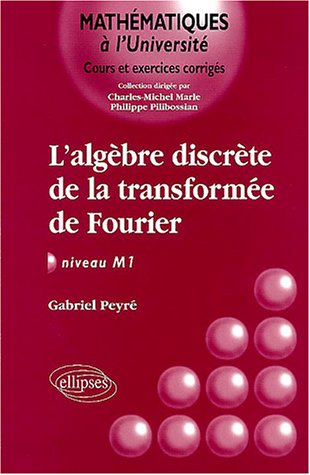

Bienvenue sur le site de promotion du livre

> [Gabriel Peyré, L'algèbre discrète de la transformée de Fourier](https://www.ceremade.dauphine.fr/~peyre/adtf/), 
> Editions Ellipses, Janvier 2004, ISBN: 2-7298-1867-7. 

 

Vous pouvez le commander sur [Amazon.fr](http://www.amazon.fr/exec/obidos/ASIN/2729818677/qid%3D1076335504/402-8203791-9438536) ou chez votre libraire préféré. 
Vous pourrez trouver sur ce site, outre le contenu détaillé du livre, de nombreux outils et solutions d'exercices pour acompagner le lecteur dans ses découvertes.

